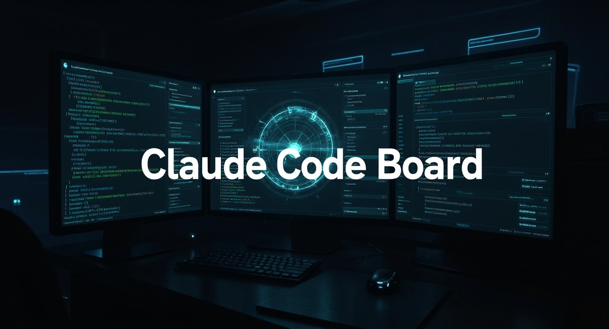
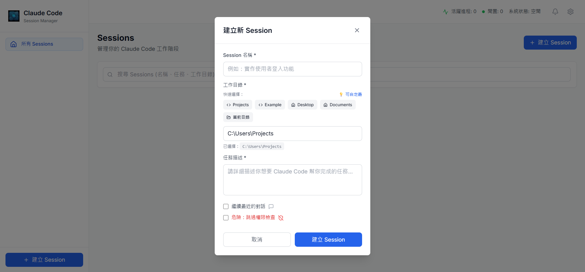

# Claude Code Board



一個功能強大的 Claude Code Session 管理系統，讓你輕鬆管理多個 AI 編程對話。

> **注意**: 目前僅支援 Windows 環境

## 🚀 主要功能

- **多 Session 管理** - 同時運行多個 Claude Code 實例
- **即時對話** - WebSocket 驅動的流暢對話體驗  
- **狀態管理** - 自動追蹤每個 Session 的執行狀態
- **歷史記錄** - 永久保存所有對話內容和執行結果
- **Session 恢復** - 延續先前的對話內容
- **危險權限跳過** - 快速執行模式（開發環境）
- **桌面通知** - Windows Toast 通知支援

## 📦 快速安裝

### 環境需求
- Windows 作業系統
- Node.js 18+
- Claude Code CLI (`npx @anthropic-ai/claude-code@latest`)

### 啟動應用
```bash
# 1. 克隆專案
git clone <repository-url>
cd Claude-Code-Board

# 2. 啟動後端
cd backend && npm install && npm run dev

# 3. 啟動前端 (新終端)
cd frontend && npm install && npm run dev
```

訪問 `http://localhost:5173` 開始使用！

也可以 npm i 之後，使用 `start.bat` 快速啟動

## 📸 功能展示

<div align="center">
  
  
</div>

## 🛠 技術架構

**後端**: Node.js + Express + SQLite + Socket.io  
**前端**: React + TypeScript + TailwindCSS