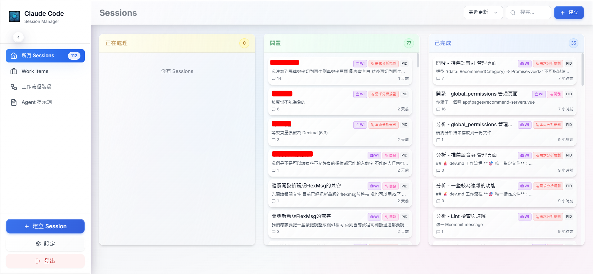
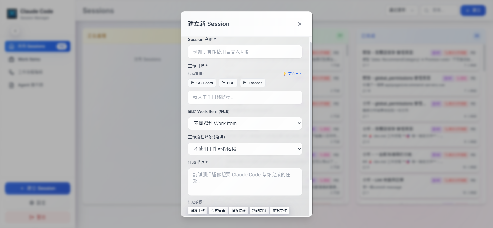
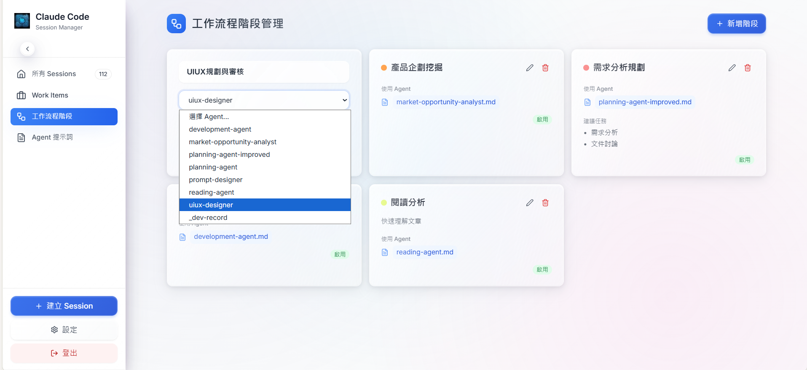
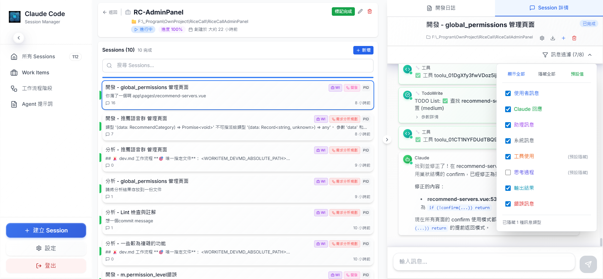
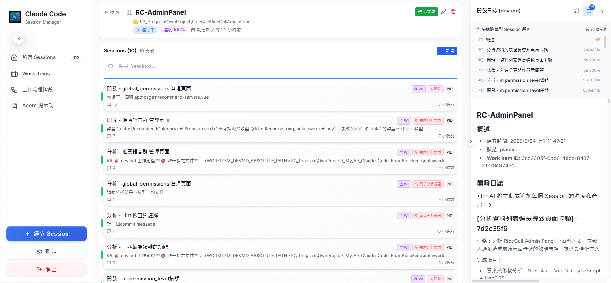
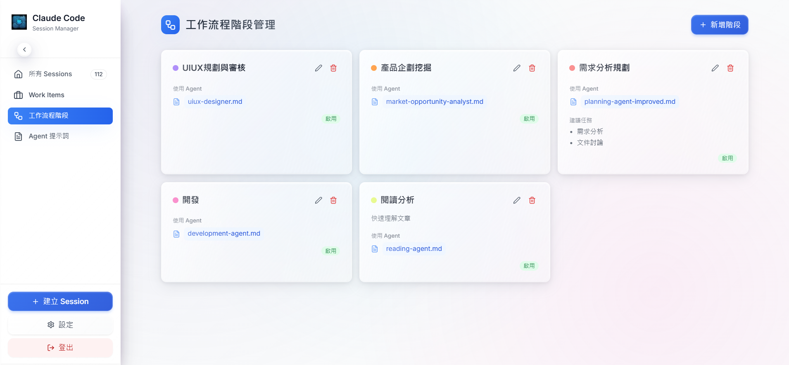
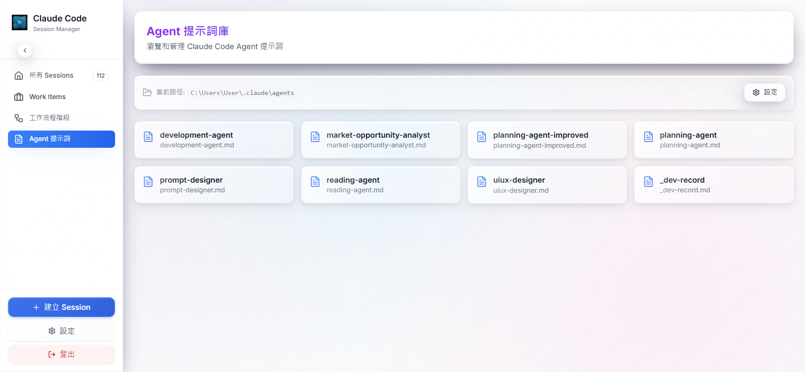

# Claude Code Board

<div align="center">


**A comprehensive session management system for Claude Code with advanced workflow capabilities**

[](package.json)
[](LICENSE)
[](#requirements)
[](https://nodejs.org/)

</div>

## 🌟 Overview

Claude Code Board is a powerful web-based management system designed for developers working with Claude Code CLI. It provides an intuitive interface to manage multiple AI coding sessions simultaneously, with advanced features including workflow automation, agent-based prompting, and intelligent project organization.


*主控制台展示多個活躍 Session 的狀態和管理界面*

## ✨ Key Features

### 🎯 Core Session Management
- **Multi-Session Support** - Run and manage multiple Claude Code instances concurrently
- **Real-time Chat Interface** - WebSocket-powered seamless conversation experience
- **Smart Status Tracking** - Automatic monitoring of session states (idle, processing, completed, error)
- **Session Recovery** - Resume previous conversations with full context preservation
- **Quick Session Launch** - Create new sessions based on existing ones with intelligent prefilling


### 🤖 Advanced AI Workflow
- **Agent Integration** - Dynamic loading of Claude agents from `.claude/agents` directory
- **Workflow Stages** - Pre-configured development stages (code review, debugging, feature development)
- **Smart Message Enhancement** - Automatic agent instruction injection for consistent behavior
- **Custom Prompt Templates** - Quick-start templates for common development tasks


### 📊 Project Organization
- **Work Items** - Organize sessions under project-specific work items
- **Project Classification** - Tag and categorize sessions with projects and topics
- **Workspace Path Integration** - Automatic working directory management
- **Development Context** - Integration with dev.md and project documentation


### 🎨 Modern UI/UX
- **Glass Morphism Design** - Beautiful frosted glass effects throughout the interface
- **Responsive Layout** - Optimized for desktop and tablet viewing
- **Dark/Light Theme Support** - Seamless theme switching capability
- **Real-time Notifications** - Windows Toast notifications for session events
- **Message Filtering** - Advanced filtering system for different message types


### 🔧 Developer Tools
- **Message Export** - Export conversation history in JSON format
- **BDD Testing Framework** - Comprehensive test coverage with Cucumber.js
- **TypeScript Support** - Full type safety across frontend and backend
- **Hot Reload Development** - Fast development workflow with automatic reloading

## 🚀 Quick Start

### Prerequisites

- **Operating System**: Windows 10/11
- **Node.js**: Version 18.0.0 or higher
- **Claude Code CLI**: Latest version installed globally
  ```bash
  npm install -g @anthropic-ai/claude-code
  ```

### Installation

1. **Clone the Repository**
   ```bash
   git clone https://github.com/yourusername/claude-code-board.git
   cd claude-code-board
   ```

2. **Install Dependencies**
   ```bash
   # Install root dependencies
   npm install

   # Install backend dependencies
   cd backend && npm install

   # Install frontend dependencies
   cd ../frontend && npm install
   ```

3. **Quick Launch**
   ```bash
   # Option 1: Use the provided batch file (Windows)
   start.bat

   # Option 2: Manual startup
   npm run dev:backend   # Terminal 1
   npm run dev:frontend  # Terminal 2
   ```

4. **Access the Application**
   - Frontend: `http://localhost:5173`
   - Backend API: `http://localhost:3001`


*初次啟動後的歡迎界面*

## 🆚 Why Claude Code Board vs Direct CLI?

### Enhanced CLI Experience
Claude Code CLI is excellent for single-focus coding sessions. However, when managing complex projects with multiple contexts, some additional capabilities become valuable:
- **Concurrent Development** - Working on multiple features or projects simultaneously
- **Session Organization** - Organizing conversations by project goals and development stages
- **Agent Workflow** - Streamlined switching between different AI specializations
- **Visual Management** - Web interface for better session overview and navigation

### Our Solution
Claude Code Board transforms the CLI experience into a comprehensive development platform:

**🔄 Multi-Session Management**
- Run multiple Claude Code instances simultaneously
- Switch between different projects and contexts seamlessly
- Each session maintains independent working directories

**🤖 Smart Agent System**
- Dynamic agent loading saves tokens and maintains prompt effectiveness
- Agent instructions are re-injected for each message, ensuring consistent behavior
- No prompt dilution over long conversations

**📊 Project Organization**
- Work Items organize sessions under project tasks
- Session templates for common development workflows
- Quick launch new sessions based on existing ones

**🎯 Workflow Stages**
- Pre-configured development stages (code review, debugging, feature development)
- Consistent AI behavior across team members
- Custom prompt templates for repeatable tasks

**💾 Session Persistence**
- Full conversation history with export capabilities
- Session recovery and continuation
- Real-time status tracking and notifications

## 🎯 Usage Guide

### Creating Your First Session


*Session 創建向導界面，支援快速模板和預設配置*

1. **Basic Setup**
   - Click "New Session" from the main dashboard
   - Enter a descriptive name for your coding task
   - Select or enter your project's working directory

2. **Advanced Configuration**
   - Choose a **Workflow Stage** for specialized AI behavior
   - Link to a **Work Item** for project organization
   - Select an **Agent** for domain-specific expertise

3. **Quick Templates**
   - Use predefined templates for common tasks:
     - 🔍 Code Review
     - 🐛 Bug Fixing
     - ✨ Feature Development
     - 📝 Documentation

### Working with Agents


*Workflow Stage 與 Agent 配置界面*

1. **Agent Setup**
   - Configure your Claude agents directory in settings
   - Agents are automatically loaded from `~/.claude/agents/`
   - Create workflow stages that reference specific agents

2. **Dynamic Agent Loading**
   - Agents are loaded on-demand for each message
   - No token waste from static prompt inclusion
   - Consistent behavior throughout conversations

### Message Management


*訊息過濾和管理界面*

- **Filtering**: Hide/show different message types (user, assistant, tool_use, thinking)
- **Export**: Download conversation history as JSON
- **Real-time Updates**: See responses as they're generated
- **Search**: Find specific messages in conversation history

### Project Organization


*專案分類和工作項目組織界面*

- **Work Items**: Group related sessions under project tasks
- **Classification**: Tag sessions with projects and topics
- **Workspace Integration**: Automatic path detection and inheritance
- **Quick Launch**: Start new sessions based on existing ones

## 🔧 Configuration

### Environment Variables

Create `.env` files in both `backend/` and `frontend/` directories:

**Backend (.env)**
```env
PORT=3001
NODE_ENV=development
DATABASE_PATH=./database/claude_code_board.db
SOCKET_PORT=3001
```

**Frontend (.env)**
```env
VITE_API_URL=http://localhost:3001
VITE_SOCKET_URL=http://localhost:3001
```

### Agent Configuration

1. **Setup Claude Agents Directory**
   - Default location: `~/.claude/agents/`
   - Configure path in application settings
   - Create `.md` files for each agent with instructions

2. **Agent File Structure**
   ```
   ~/.claude/agents/
   ├── code-reviewer.md     # Code review specialist
   ├── debugger.md          # Bug fixing expert
   ├── architect.md         # System design advisor
   └── documenter.md        # Documentation writer
   ```

### Workflow Stages


*Workflow Stage 編輯界面展示 Agent 選擇和自訂提示*


*展示 Agent*

- **Custom Prompts**: Define stage-specific system prompts
- **Agent References**: Link stages to specific Claude agents
- **Suggested Tasks**: Provide task templates for each stage
- **Color Coding**: Visual organization with custom colors


## 📝 License

This project is licensed under the ISC License - see the [LICENSE](LICENSE) file for details.

## 🤝 Support

### Getting Help

- 📚 **Documentation**: Check this README and inline code documentation
- 🐛 **Bug Reports**: Open an issue on GitHub
- 💡 **Feature Requests**: Discuss in GitHub Discussions
- 💬 **Community**: Join our Discord server (coming soon)

### Acknowledgments

- **Anthropic**: For the amazing Claude Code CLI
- **React Community**: For excellent documentation and ecosystem
- **TailwindCSS**: For the utility-first CSS framework
- **Socket.IO**: For real-time communication capabilities

---

<div align="center">

**Built with ❤️ for developers who love AI-powered coding**

[⭐ Star this repo](https://github.com/yourusername/claude-code-board) • [🐛 Report Bug](https://github.com/yourusername/claude-code-board/issues) • [💡 Request Feature](https://github.com/yourusername/claude-code-board/issues)

</div>